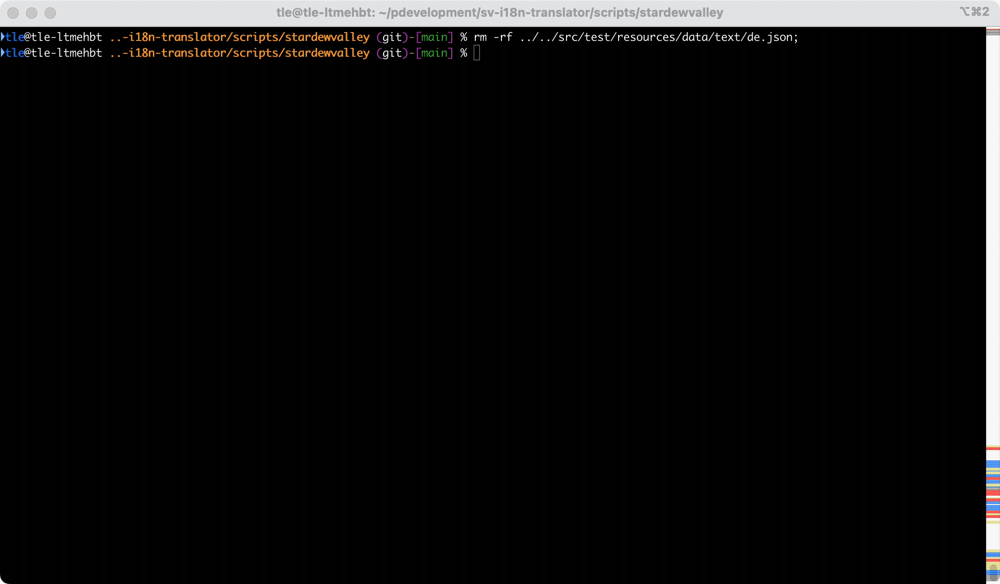

# SV i18n Translator

This project was created to translate large i18n files of Stardew Valley mods to german.

I've used it to create translations for Stardew Valley Expanded and Ridgeside Village.

The tool is meant to be used as a dev tool by mod creators. It still has some rough edges and may or may not work for you.

> [!IMPORTANT]
> In any case, as with every content created using LLM/GPT, you should always double-check the results. They're often "good enough" but by no means perfect.

## Features
- Automatically synchronizes added/removed keys of source file to target file
- Retains formatting of source file
- Configurable validations
  - Checks for dialogue control sequences (see [src/main/resources/validation/stardewvalley.json](src/main/resources/validation/stardewvalley.json))
- Multiple translation adapters supported:
  - **OpenAI** - Uses gpt-5.1 by default
  - **Anthropic** - Uses claude-sonnet-4-5 by default
  - **Gemini** - Uses gemini-3-pro-preview by default
  - **Zai** - Uses glm-4.7 by default
  - **Moonshot** - Uses kimi-k2.5 by default
  - **DeepL** - Professional translation service
  - **Ollama** - Local LLM via REST API
  - **Manual** - For testing purposes
- Uses simple zero-shot prompting
  - If a validation fails, it will retry with higher temperature

## Usage

### Requirements

- JDK > 17
- Maven 3.x
- API key for your chosen translation service:
  - OpenAI: https://platform.openai.com/api-keys
  - Anthropic: https://console.anthropic.com/settings/keys
  - Gemini: https://aistudio.google.com/app/apikey
  - Zai: https://open.bigmodel.cn/usercenter/apikeys
  - Moonshot: https://platform.moonshot.ai
  - DeepL: https://www.deepl.com/pro-api

### Run using scripts

Clone repository or download repository as zip. A jar file is included under `/target/sv-i18n-translator.jar`.

The bundled scripts are configured to translate the input text to German using your chosen LLM adapter (OpenAI, Anthropic, Gemini, or Zai). You must obtain an API key for your chosen service first.

See the [Windows Quick Manual](docs/windows-quick-manual.md) or [General Manual](docs/general-manual.md) for configuration options and adapter-specific settings.

```bash
cd scripts/stardewvalley
```

#### Sync

This will synchronize the keys of the source file to the target file.

New keys will be added to the target file and keys that are not present in the source file will be removed from the target file.

```bash
# Usage:
# ./sync.sh "/path/to/source/default.json" "Language"

./sync.sh "../../src/test/resources/data/text/default.json" "German"
```

###### Example

In the example below, the sync step is executed. Since the target file doesn't exist yet, all keys are considered "\<MISSING\>".



#### Translate

This will translate the target file using the configured LLM API.

The API key must be provided either as an environment variable or as a parameter.

```bash
# Usage (with API key set as environment variable):
# ./translate.sh "/path/to/source/default.json" "Language"

export OPEN_AI_API_KEY="sk-..."      # For OpenAI
# or
export ANTHROPIC_API_KEY="sk-..."    # For Anthropic
# or
export GEMINI_API_KEY="..."          # For Gemini
# or
export ZAI_API_KEY="..."             # For Zai
# or
export MOONSHOT_API_KEY="..."        # For Moonshot

./translate.sh "../../src/test/resources/data/text/default.json" "German"
```

```bash
# Usage (with API key as 3rd parameter):
# ./translate.sh "/path/to/source/default.json" "Language" "API Key"

./translate.sh "../../src/test/resources/data/text/default.json" "German" "sk-..."
```

###### Example

In the example below, the translate step is executed. All keys that are tagged with \<ERROR\> or \<MISSING\> are picked up for translation.


#### Revalidate

This will revalidate the target file with the current validation configuration.

Use this, if the code or the validation configuration has changed. If a translation is not accepted by the current validation anymore, it will be tagged with <ERROR> and will be picked up during translation again.

```bash
# Usage:
# ./revalidate.sh "/path/to/source/default.json" "Language"

./revalidate.sh "../../src/test/resources/data/text/default.json" "German"
```

#### Reformat

This will reformat the target file to match the source file.

```bash
# Usage:
# ./reformat.sh "/path/to/source/default.json" "Language"

./reformat.sh "../../src/test/resources/data/text/default.json" "German"
```
